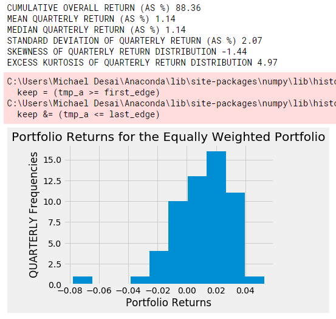

# Asset Allocation Project

### Prepared by Michael Desai
### Virginia Retirement System Interview

<br>

Given time-series data for 10 unidentified assets, derive a portfolio construction methodology that rebalances, and discuss your approach. 

<br>

Questions from Prompt: <br>

<ul>
    <li>Calculate returns from the indices provided.</li>
    <li>Perform some univariate data analyses to get a sense of the data.  How did you choose to explore the data?  What did you find? </li>
    <li>Derive a portfolio construction methodology that rebalances at max once monthly.  The strategy should assign monthly weights to all or a subset of the provided assets. </li>
    <li>Explain your portfolio construction methodology and any others that you tested.  What were the tradeoffs for each method you evaluated?  Why did you select the one you chose?  How can you evaluate the success of your preferred and alternate methodologies?</li>
    <li>How generalizable would you expect your methodology to be going forward?</li>
</ul><br>

### For Readers:
All notebooks are organized by number, starting with 1. To inspect the code and visualizations produced, follow along in the notebooks themselves, which are all commented and have markdown within them. You can also follow along in this README to read my descriptions of each process and my analytical conclusions. 

IF YOU ARE ONLY INTERESTED IN THE ANALYSIS AND PORTFOLIO CONSTRUCTION, SKIP AHEAD TO SECTION <b>3 - EXPLORATORY DATA ANALYSIS</b>.

<br>

# 1 - Cleaning the Data

### Associated Notebook: 1_cleaning_data.ipynb

<br>


The raw data was disorganized and not suitable for further analysis. Dates and their associated asset values are in alternating columns of varying lengths. Luckily, fitting it to a useable pandas dataframe is not too bad.  

First, I explored the data manually and determined the earliest starting date and the latest ending date for all assets. I then created a pandas datetime range that corresponded to those values so that all the assets would be on the same datetime index, which was frequenced by business day ('B').

Second, because every column was alternating dates and values, I used a modulo-division rule to append all date columns to a list, and all asset values to a different list, while track of what number they were, using enumerate() so they could be recombined later on with the same number. 

```python
for column_label in enumerate(data.columns):
        if column_label[0] % 2 == 0:
            date_cols.append(column_label[1])
        else:
            asset_cols.append(column_label[1])
```
Third, I added the datetime column as a new column to the combined dataframe, then used this datetime column to reindex and create a new series out of each asset column, then made sure to append them to a list of data series, returned this data series, and then wrote each series to its own csv file in the data_clean directory. 

```python
for asset in enumerate(asset_cols):
        columns = data.columns
        modifier = len(asset_cols)
        asset_label = asset[1]
        date_label = columns[asset[0] + modifier]
        new_series = pd.DataFrame(data[[date_label, asset_label]]).set_index(date_label).rename_axis(index='Date').sort_index(ascending=False).dropna()
        new_series = new_series.reindex(date_range).sort_index()
        series.append(new_series)
```
I used a lot of loops here, but if I was going to refactor it I would use list comprehensions to perform the same transformations in fewer lines of code.

This function was exported to the utilities.py file, where it is used in other files several times. 


<br>

# 2 - Feature Extraction
### Associated Notebook: 2_feature_extraction.ipynb

<br>

Time Series requires a lot of feature extraction, including rolling and cumulative risk and return metrics. This file was produced to assist with the exploratory data analysis (EDA). The idea behind this is that it would be easier to extract the features and then visualize them in the EDA stage. 

Due to the decision made when cleaning the data, our datetime index for each of the assets is frequenced by business day - there are more business days than there are trading days in the year. My thinking was that trading days are the more important measure, so the window I used to calculate all rolling metrics was 252. I made it so it would be easy to change this. 

There is a lot of repeated code in this function to extract features, which means there are a lot of optimizations that can be done on it to make it more efficient. 

This function was also exported to the utilities.py file. 

<br>

# 3 - Exploratory Data Analysis
### Associated Notebook: 3_EDA.ipynb

<br>

This is where the analysis of the data begins. Since the assets are unidentified, I thought it was a good idea to explore the data via linear trends, frequency distributions, and then finally through summarizing statistics. 

Please refer to the the notebook to see my notes on each series. 

<br>

# 4 - Portfolio Derivation
### Associated Notebook: 4_portfolio_derivation.ipynb

<br>

Markowitz's modern portfolio theory provides the principles used to create this asset allocation strategy. The idea behind MPT is to maximize return (or expected return) while minimizing risk, which I represented using a covariance matrix of asset returns against each other. 

Since coding measures of expected return and covariance are nontrivial tasks, and also because others have already provided the tools to calculate these measures easily, I used an open-source library, PyPortfolioOpt, to create two single-factor test portfolios. 


This asset allocation strategy is based on the concept of the efficent frontier, which is the set of return-maximizing portfolios of assets at a given level of risk. It is important to optimize a portfolio to a point lying tangent on the efficient frontier, since if it is below the line, the portfolio is not offering enough return for its given level of risk, and if it is above, the portfolio has not minimized variance for that given level of return. 

As far as actually coding this process out, we need two things:

<ul>
    <li>An estimate of expected future returns for each asset.</li>
    <li>The covariance of all assets' returns with each other.</li>
</ul>

Expected Returns can be estimated in a variety of ways - you can use the Capital Asset Pricing Model (CAPM), but because I lack a "true" estimate of risk free rate and market beta, I avoided this approach. You can also use the historical mean return for each asset, but the issue with this is that it gives equal importance and weight to very distant period's returns - i.e. 2006's returns for the asset's expected return are just as important as 2020's. I thought it was more likely that returns would follow a more recent pattern of returns, i.e. would follow the current trend. This is why I used <b>exponentially weighted historical returns</b> where more recent periods' returns are weighted more heavily in producing the expected return for each asset. 

This approach to calculating recent returns would also make the strategy's return be very receptive to rebalancing. This is due to the fact that as the assets' returns are updated monthly, quarterly, or annually, the weight given to more recent periods compounds, potentially changing the weights of the portfolio drastically. 


Variance of the portfolio is based on which assets are in the portfolio. To visualize this, I created correlograms which show the covariance matrix of each asset with each other asset in a grid. 


One thing I noticed was how loosely correlated most of the assets are, with a few notable exceptions - asset8 seems to be tightly correlated with assets1, 2, and 3. And assets 7 and 9 appear to be very strongly uncorrelated. Nothing is perfectly uncorrelated. 

The calculation of sample covariance across all assets would have sufficed, but in doing the research for this project, I read about how positive errors in sample covariance calcuations can lead to major errors in automated trading. So I applied a Ledoit-Wolf covariance shrinkage transformation - which essentially shrinks all outliers towards an estimate of the most commonly occuring covariance. The effect of this transformation can be seen in the below correlogram - if you notice the high positive correlations in the graph are not quite as extreme. 

Reference: [Ledoit Wolf 2003 - Honey I Shurnk the Covariance Matrix](http://www.ledoit.net/honey.pdf)


Using these estimates, it became possible using PyPortfolioOpt to derive portfolio weights by setting an objective function for a single factor. I set two objectives, creating one portfolio targetting <b>maximizing Sharpe ratios</b> and another portfolio targetting <b>minimizing variance.</b>

```python
from pypfopt import EfficientFrontier

ef = EfficientFrontier(mu, V, weight_bounds=(0, 1))
ef.max_sharpe()
cleaned_weights = ef.clean_weights()
pd.Series(cleaned_weights).plot.pie(figsize=(5, 5))
ef.save_weights_to_file('weights/max_sharpe_weights.csv')
ef.portfolio_performance(verbose=True)
```
Weights Maximizing Sharpe Ratio


Weights Minimizing Variance


Code-wise, this process ended with the asset weights saved to a directory called "weights" that would be used to actually test the performance of this weighted portfolio, in the next section.


## Weaknesses of this approach

The main issue with my allocation strategy as presented is that because risk is measured as variance instead of as VaR, or downside risk, it potentially has a high rate of false negatives - that is, considering investments with high upside variance as unsuitable for a portfolio, when they, in fact would be the ideal investements for maximizing return. Since MPT's notion of variance is symmetrical, this is a problem. 

Another issue is potentially the impact of rebalancing when using expoentially weighted returns to estimate expected return, since this gives a lot more weight to recent performance of underlying assets, it may shift around weights poorly. 

<br>

# 5 - Portfolio Measurement and Analysis
### Associated Notebook: 5_portfolio_measurement_analysis.ipynb

<br>

With the weights calculated, I then decided to backtest the portfolios, and add a third, an equally weighted portfolio of all 10 assets, as a benchmark. I thought it would not make sense to select a real benchmark like the BAML bond index, Barclay's Agg, or S&P500 without knowing what the assets were, and thought an equally weighted portfolio would serve just as well. 

```python

def weighted_portfolio(portfolio, weights, type):
    if type == "max_sharpe":
        
        mask = list(weights['max_sharpe'])
        wt_values = (mask * portfolio.dropna())
        portfolio_value = wt_values.sum(axis=1)
        
    elif type == 'min_vol':
        
        mask = list(weights['min_vol'])
        wt_values = (mask * portfolio.dropna())
        portfolio_value = wt_values.sum(axis=1)
        
    else:
        
        weights['min_vol'] = 1 / len(list(weights['min_vol']))
        mask = list(weights['min_vol'])
        wt_values = (mask * portfolio.dropna())
        portfolio_value = wt_values.sum(axis=1)
    
    return portfolio_value
    
    
max_sharpe_portfolio = weighted_portfolio(portfolio, weights, 'max_sharpe')
min_vol_portfolio = weighted_portfolio(portfolio, weights, 'min_vol')
equally_weighted_portfolio = weighted_portfolio(portfolio, weights, 'equal')

```

Applying the weights correctly was tricky, and important to get right. This is where I encountered some difficulty in thinking about the best way to summarize returns and how to downsample effectively. If I had more time, I would certaintly spend it here, checking everything over. 

The goal was to produce some summarizing statistics and a histogram of each portfolio's quarterly performance. 

One of the ways I chose to evaluate the portfolio was to look at a frequency histogram of quarterly mean returns, and to pay special attention to the skew and kurtosis of each distribution. The ideal portfolio I think would exhibit positive skew, and very low, even negative, excess kurtosis. Positive skew is obviously desirable, since it means there is a higher frequency of positive returns every day. Low excess kurtosis is also desirable since a highly leptokurtic (peaked) normal distribution has fatter tails, and potentially many, many outliers. 

Luckily, the maximized Sharpe and minimized volatility portfolios exhibited these characteristics for the most part. Both portfolios have low negative skew, and very low excess kurtosis. The equally weighted portfolio has less desirable stats in both. See below. 

Minimized Volatility Portfolio:


Maximized Sharpe Portfolio:


Equally Weighted Portfolio:


Because I was curious, I also computed Sharpe ratios for each portfolio, for each year, and then visualized them.

```python
def sharpe_comparison(data, start_date, names, rfr):
    import numpy as np
    
    samples_per_year = 252
    sharpes = pd.DataFrame([])
    
    date = pd.to_datetime(start_date)
    starting_year = date.year
    
    for series in enumerate(data):
        annual_returns = series[1].pct_change().resample('A').mean()
        annual_vol = series[1].pct_change().resample('A').std()
        
        new_series = np.sqrt(samples_per_year) * (annual_returns / annual_vol)
        new_series = new_series.rename(names[series[0]])
        
        if sharpes.empty == True:
            sharpes = new_series
        else: 
            sharpes = pd.merge(sharpes, new_series, how='inner', on='Date');
    
    sharpes.loc[date:].plot.barh(figsize=(12, 12))
    return sharpes
```


However, I believe these are at best, estimates of the Sharpe ratio, since it incorporates only an estimate of the risk free rate, so the real Sharpes are lower than these and probably approach 1 - 1.5.

<br>

# 6 - Rebalancing Workflow (Incomplete, but Extensible from current code)
### Associated Notebook: 6_rebalancing_workflow.ipynb
<br>

Because making sure the weights and portfolio were produced correctly took up most of the time I had available to do this project, I only have a plan for how to implement rebalancing, but did not have time to implement it in code and see what the effects of constant rebalancing would have had on the cumulative returns of each portfolio. 

Rebalancing the portfolio is possible from the current code schema, and I will discuss here the analytical approach to deciding on a rebalancing frequency, as well as how to extend the current code to incorporate this feature. 

## Rebalancing Frequency

This is a key question for the viability of the allocation strategy. Rebalancing frequently means fewer weights will be adjusted every time, but frequent rebalancing commonly drains alpha on the portfolio due to transaction costs. With bonds, rebalancing a portfolio more frequently than a month is likely to be impossible or very expensive due to the lack of liquidity and quotes. 

Additionally, using exponentially weighted historical returns as estimates for expected returns weights the current period's returns more highly. The danger here is letting a single period's out-of-sample extremely positive or negative returns dictate that weights swing wildly from one rebalancing period to the next. In other words, as short-term volatility increases, the risk of using EMA as a key input to the asset allocation strategy is more problematic, especially if the objective of the portfolio is to minimize volatility or maximize Sharpe, both strategies which tend to underweight extremely volatile assets. 

Thus, I think it's worth considering to only remeasure and rebalance portfolio weights once every quarter, or three months. The basis for saying this is that the interquartile range of returns in this time frame for each asset is much larger than for single months, which are extremely small, with most observations falling outside the IQR. It would still give plenty of weight to recent observations of price and correlations, and allow for the portfolio managers to avoid losses in times of extreme market downturns, but it would also minimize any rebalancing transaction losses that would occur from rebalancing when the market is not volatile. 

## Coding a Rebalancing Functionality

Creating this functionality would involve reorganizing many of the functions I have written into a complete iterable process, that would proferrably only have to be called once, or set up in a series of OOP-friendly classes that have pre-built interactions with each other, although that approach would require a lot of planning that may be inefficient. 

The flowchart would be the following:

<ol>
    <li> At time index t + quarter, collect and merge new return data to existing return data, and remeasure EMA, Wolf-Ledoit Covariance Matrix. </li>
    <li> Feed EMA and Cov-Matrix to derive new weights. </li>
    <li> Compare existing weights to new weights and subtract/add difference to weights for this time-index, and recalculate the weighted average cumulative return for the portfolio. </li>
</ol>

This would not be difficult to implement, but would require some shuffling around of the functions I've written, and perhaps creating more functions that I can import into a single notebook to test. 

## Hypothesizing the impact of Rebalancing on portfolio cumulative return

Changing the code around would not be the only impact of rebalancing every quarter. These portfolios would have to be re-evaluated and their performance measures re-calculated on the assumption that every quarter would have had rebalancing, which would in turn effect the weights for the assets, and thus the portfolio return, and thus the cumulative return. 

Estimating the impact of this is also nontrivial, but it is extensible from the code written in these notebooks. 

I believe the generalizability of these strategies would depend in large part on the findings of this historical quarterly rebalancing on cumulative return. It answers the question, could this have been happening over the past 15 years and still have generated significant alpha?

<br>